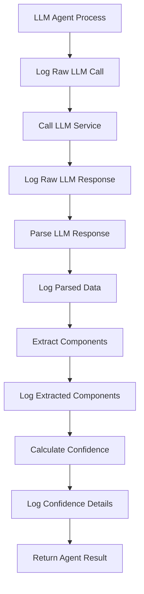

# Design Document

## Overview

This design implements comprehensive logging for LLM agent outputs by extending the existing logging infrastructure with specialized LLM loggers and structured logging formats. The solution integrates with the current logging system while providing detailed visibility into LLM interactions, response parsing, and agent-specific processing.

## Architecture

### Component Integration

The logging enhancement integrates with existing components:

- **LLMAgent Base Class**: Enhanced with logging calls at key processing points
- **LLM Enhanced Agents**: Modified to log agent-specific outputs and reasoning
- **Logging Configuration**: Extended with LLM-specific loggers and formatters
- **Structured Logging**: Enhanced to capture LLM-specific metadata

### Logging Flow



## Components and Interfaces

### LLMAgentLogger Class

A specialized logger class for LLM agent interactions:

```python
class LLMAgentLogger:
    def __init__(self, agent_name: str, logger_name: str = 'llm_agents')
    def log_llm_call(self, prompt: str, context: Dict, session_id: str, iteration: int)
    def log_llm_response(self, response: Dict, session_id: str, iteration: int)
    def log_parsed_response(self, parsed_data: Dict, session_id: str, iteration: int)
    def log_component_extraction(self, component_type: str, extracted_data: Any, success: bool)
    def log_confidence_calculation(self, confidence_score: float, reasoning: str)
    def log_agent_reasoning(self, reasoning_type: str, reasoning_text: str)
```

### Enhanced LLMAgent Base Class

Modified to include logging at key processing points:

- `_call_llm()`: Log outgoing prompts and incoming responses
- `_parse_llm_response()`: Log parsing results and any issues
- `_extract_*()` methods: Log extraction success/failure and extracted data
- Confidence calculation methods: Log confidence reasoning

### Agent-Specific Logging Extensions

Each LLM enhanced agent will have specialized logging:

- **LLMAnalyzerAgent**: Log analysis insights, structure assessment, clarity evaluation
- **LLMRefinerAgent**: Log refinement reasoning, applied techniques, improvement quality
- **LLMValidatorAgent**: Log validation results, critical issues, compliance assessment

## Data Models

### LLM Interaction Log Entry

```python
{
    "timestamp": "2025-01-09T10:30:00Z",
    "level": "INFO",
    "logger": "llm_agents.analyzer",
    "session_id": "session_123",
    "iteration": 2,
    "agent_name": "LLMAnalyzerAgent",
    "interaction_type": "llm_response",
    "model_used": "claude-3-sonnet",
    "tokens_used": 1250,
    "processing_time": 2.3,
    "response_length": 1800,
    "confidence_score": 0.85,
    "extraction_success": true,
    "raw_response": "...",
    "parsed_components": {...},
    "reasoning": "..."
}
```

### Agent-Specific Log Metadata

Additional fields for each agent type:

- **Analyzer**: `analysis_type`, `insights_extracted`, `issues_identified`
- **Refiner**: `refinement_techniques`, `improvements_made`, `quality_score`
- **Validator**: `validation_criteria`, `passes_validation`, `critical_issues_count`

## Error Handling

### Logging Failure Resilience

- Logging failures will not interrupt agent processing
- Failed logging attempts will be logged to a separate error log
- Fallback to basic logging if structured logging fails
- Graceful degradation when log storage is unavailable

### LLM Response Parsing Errors

- Log parsing failures with error details
- Log partial extraction results when possible
- Track parsing success rates for monitoring
- Include raw response in logs when parsing fails

## Testing Strategy

### Unit Tests

- Test LLMAgentLogger class methods with mock data
- Test logging integration in each LLM enhanced agent
- Test error handling and fallback scenarios
- Test log level filtering and configuration

### Integration Tests

- Test end-to-end logging flow with real LLM agents
- Test log aggregation and structured output
- Test performance impact of enhanced logging
- Test log rotation and storage management

### Performance Tests

- Measure logging overhead on agent processing time
- Test log volume and storage requirements
- Test concurrent logging from multiple agents
- Validate memory usage with extensive logging

## Implementation Details

### Logging Configuration Updates

Extend `logging_config.py` with:

- LLM-specific logger configuration
- Structured formatter for LLM interactions
- Separate log files for LLM outputs
- Configurable log levels for LLM components

### Agent Integration Points

Key integration points in each agent:

1. **LLMAgent._call_llm()**: Log prompt and response
2. **LLMAgent._parse_llm_response()**: Log parsing results
3. **Agent-specific process()**: Log agent reasoning and outputs
4. **Component extraction methods**: Log extraction details
5. **Confidence calculation**: Log confidence reasoning

### Configuration Options

New configuration parameters:

- `llm_logging_level`: Separate log level for LLM interactions
- `log_raw_responses`: Whether to include full LLM responses
- `log_prompts`: Whether to log outgoing prompts (security consideration)
- `llm_log_file`: Separate log file for LLM interactions
- `max_response_log_length`: Truncate long responses in logs

### Security Considerations

- Option to exclude sensitive prompts from logs
- Configurable response truncation for large outputs
- Separate log files with appropriate access controls
- Option to hash or anonymize logged content